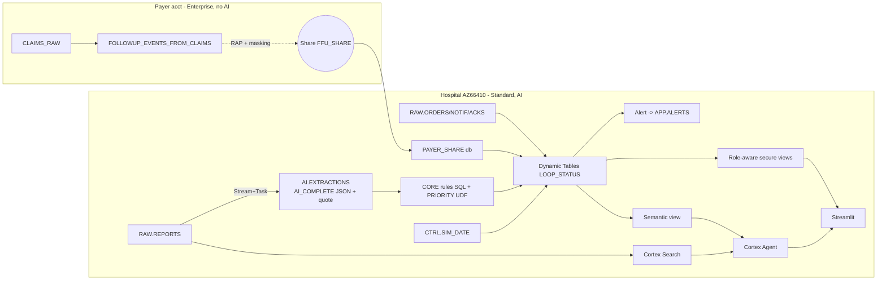

# PLAN_SPEC - Forgotten Follow-ups (Track 4)

Plan mode only lets me write plan files, so this plan is shown here. After you approve, my first action is to save it as `docs/PLAN_SPEC.md`.

**Checks (read-only, all passed):** role ACCOUNTADMIN, account AZ66410, AZURE_CENTRALINDIA, COMPUTE_WH, CORTEX_ENABLED_CROSS_REGION=ANY_REGION, `AI_COMPLETE('claude-sonnet-4-5')` returned OK. I could not read the edition from SQL, so I am taking Standard from your brief. **Your answers:** Set C has 2,000 patients; the payer locator gets looked up in Block 1; we reuse COMPUTE_WH (XS, 60s auto-suspend, 10-credit monitor).

## 1. Goals and non-goals
- **Goals:** extract follow-up recommendations with verbatim quotes; close loops with deterministic SQL using hospital records plus payer claims shared across accounts; ranked worklist, cited copilot, measured safety (false greens).
- **Non-goals:** diagnosis, overriding the radiologist, sending messages without approval, ABDM, Synthea, Marketplace, Native App, Snowflake Intelligence, Hindi letter, Git integration, fresh-account rebuild test (all listed as roadmap).

## 2. Architecture

## 3. Data model (hospital DB `FFU`, unless marked as payer)
- `KEY.ANSWER_KEY` (finding_id PK, patient_id, finding_type, size_mm, solid_mm, laterality, rec_action, due_months, traps, expected_status): hidden; reports are generated from it.
- `RAW.PATIENTS` (patient_id PK, age, sex, smoker, known_cancer, immunosuppressed, screening_enrolled, tb_history, clinic_id)
- `RAW.REPORTS` (report_id PK, patient_id, report_date, modality, cpt, text, is_addendum, parent_report_id, set_name A/B/C)
- `RAW.ORDERS`, `RAW.NOTIFICATIONS` (patient told), `RAW.ACKS` (clinician acknowledged); key is patient_id plus date
- `AI.EXTRACTIONS` (report_id, finding_seq, finding_type, size_mm, solid_mm, laterality, rec_action, modality, region, due_min/max_months, hedged, negated, stable, quote, quote_verified, model, extracted_at); PK is report_id plus finding_seq
- `AI.FOLLOWUP_CHECKS` (loop_id, report_id, ai_filter_result): cached AI_FILTER results
- **Payer** `PAYER_DB.SHARED.FOLLOWUP_EVENTS_FROM_CLAIMS` (event_id, patient_id, service_date, cpt, facility, provider_account)
- `CTRL.SIM_DATE` (sim_date); `APP.ALERTS`, `APP.APPROVALS`, `APP.OUTSIDE_REPORT_REQUESTS`

## 4. Rules (deterministic SQL in `CORE`)
- **Nodule:** size = (long+short)/2, rounded per Fleischner; part-solid nodules use the solid part. Tier 1: solid >8 mm, or solid part ≥6 mm. Due window from the Fleischner table (paraphrased).
- **CXR "recommend CT":** CT within the stated window; "suspicious"/"mass" is tier 1.
- **AAA:** referral at diagnosis plus size-based surveillance; tier 1 at ≥5.5 cm (M) or ≥5.0 cm (F), or symptomatic.
- **Thyroid:** NOT pre-built; only `tests/thyroid_*.sql` are prepared in advance.
- **Routing:** known cancer, immunosuppression, age <35 or screening enrolment go to a REROUTED pathway with the reason shown.
- **Two halves:** communication (ack + notified) and completion are tracked separately.
- **Closure:** CPT 71250/71260/71270 or PET/biopsy inside the window closes a CT loop; 71271 (LDCT) is accepted only for screening-pathway loops; CXR 71045/71046 never closes one and the reason is shown. A payer-only match gives AMBER plus an outside-report request. A hospital report plus AI_FILTER "discusses original finding" gives GREEN. CANCELLED requires a reason and a sign-off. Closing a surveillance loop opens the next one.
- **Priority UDF (Snowpark Python):** tier × 1000 + elapsed-window% × 100 + context (age, smoking); returns JSON with the breakdown. TB history is context only; never-smoker women are not downgraded. A QA flag is raised if the radiologist's recommendation differs from the guideline.

## 5. Object inventory
`FFU.{RAW, KEY, AI, CORE, CTRL, APP, SEC, EVAL}`. Stream `RAW.REPORTS_STREAM`, Task `AI.EXTRACT_TASK`, Dynamic Tables `CORE.LOOPS`, `CORE.LOOP_STATUS`, `CORE.WORKLIST`, Alert `APP.OVERDUE_ALERT`, UDF `CORE.PRIORITY`, procedures `GEN_DATA`, `GEN_REPORTS`, `EXTRACT`, `VERIFY_QUOTES`, Cortex Search `APP.REPORT_SEARCH` (reports + `RULE_TEXT`), semantic view `APP.LOOPS_SV`, Agent `APP.FFU_AGENT` (tools: explain_priority, draft_letter), roles `COORDINATOR` and `ANALYST`, secure views in `SEC`, Streamlit `APP.FFU_APP`, resource monitor `FFU_RM`. Payer side: `PAYER_DB`, row access policy, masking policy, share `FFU_SHARE`.

## 6. CoCo extensibility
- **Skills:** `guideline-rule-compiler` and `loop-auditor` (core, Block 4); `report-trap-writer` and `demo-reset` (extras).
- **Agents:** `eval-runner` and `rule-reviewer` (extras).
- **Hooks** in `.cortex/settings.json`: a PreToolUse hook (PowerShell script) blocks SSN/Aadhaar-like patterns, DROP of SEC views or policies, and DROP/TRUNCATE/CREATE OR REPLACE on CORE/RAW; a SessionEnd hook appends to `docs/coco-log.md`.

## 7. Evaluation
- **Set B:** 30-40 trap reports. **Set C:** 2,000 patients (about 600 reports, claude-haiku-4-5).
- **Metrics:** per-field precision and recall with Wilson 95% CIs, false greens with a rule-of-3 upper bound, status accuracy, quote-verified %, keyword and AI-only baselines, 3 failure cases, latency, cost per 1,000 from ACCOUNT_USAGE / CORTEX_FUNCTIONS usage, and a simulated completion of 37% vs. our measured rate. Results go in `eval/metrics.json`.

## 8. Demo
Follows section 12 of your brief, using a seeded patient (9x10 mm RUL nodule), a decoy CXR-claim patient, `demo-reset`, a warm warehouse and refresh buttons. The PDF amber-to-green step is extra 1, with a fallback of a text outside report.

## 9. Blocks and acceptance criteria
1. **By 1 PM:** scaffold, monitor, data, AI reports, payer table, 1 row visible through the share. *Accept:* `SELECT` on the shared table works from the hospital account.
2. **By 4 PM:** extraction plus quotes, routing, closure incl. decoy, UDF, SIM_DATE, Dynamic Tables, Alert. *Accept:* moving SIM_DATE turns a seeded loop red and writes an alert row; the decoy stays red.
3. **By 6:30 PM:** Search, semantic view, Agent, quote verification, access control, Streamlit pages. *Accept:* the agent gives a cited "why first"; the ANALYST role sees masked data.
4. **By 8 PM:** Sets B/C, baselines, metrics, 2 skills, hook. *Accept:* metrics committed; the hook blocks a test DROP. **8 PM hard stop.**
5. **By 10 PM:** README, DATASETS.md, deck outline, demo script.

## 10. Your manual actions
1. Block 1: on the payer account, run `snow sql -c payer -q "SELECT CURRENT_ORGANIZATION_NAME(), CURRENT_ACCOUNT_NAME()"` and paste the result. Then run the payer scripts I give you: `snow sql -c payer -f sql/payer/01_payer.sql`.
2. Check `connections.toml` is outside the repo (it lives in `~/.snowflake`).
3. Record the video.

## 11. Risks and fallbacks
- **Share fails:** fall back to a separate DB plus a secure view, documented honestly.
- **Consumer-side policies:** RAP/masking on shared data evaluate CURRENT_ACCOUNT() from the consumer. If that misbehaves, use a secure view filtered by CURRENT_ACCOUNT().
- **Dynamic Tables and non-deterministic functions:** CURRENT_DATE is avoided by using SIM_DATE.
- **AI cost:** results are cached, haiku does bulk work, and the 10-credit monitor protects spend.
- **Cortex Agent API on Standard edition:** I'll verify it on day 1. If it's unavailable, the fallback is an AI_COMPLETE + Search chat in Streamlit.

## 12. Open questions
None blocking. The payer locator gets looked up in Block 1.

## 13. Name ideas
LoopCloser, Followthrough, NoLooseEnds, RecallRadar, ClosedLoop Copilot.

## Team decision
Solo. The work is a tightly coupled sequential SQL pipeline on one account, so coordination overhead outweighs the benefit.