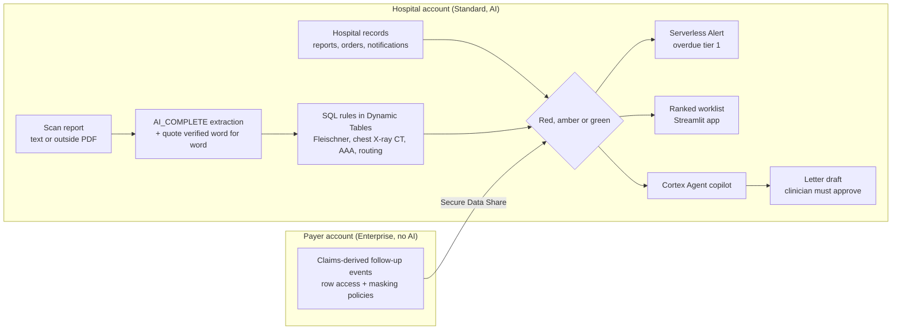

# Forgotten Follow-ups

**When a scan report says "repeat this scan in 6 months" or "refer to a surgeon", this copilot makes sure it happens, and proves every step with the exact source line.**

- **Problem:** follow-ups recommended in scan reports get lost. Only 37% of recommended lung nodule follow-ups were completed before a tracking programme. Hospital trackers also cannot see tests done at another hospital.
- **What it does:** AI reads each report and quotes the recommendation word for word. SQL rules decide the due date and tier. Hospital records and the payer's claims (through Secure Data Sharing) decide if it was done. AI extracts; rules decide.
- **Result:** 99.1% loop-status accuracy with 0 false greens on 700 synthetic reports, 36 of 36 on trap reports, and 21 of 24 real X-ray follow-ups found (17 of 24 blind).

**Links:** [Deployed app](https://app.snowflake.com/JVHFISR/pb73401/#/streamlit-apps/FFU.APP.FFU_APP) | Demo video: VIDEO_LINK_HERE | [Deck outline](docs/DECK_OUTLINE.md) | [Demo script](docs/DEMO_SCRIPT.md) | [Rule sheet](docs/RULE_SHEET.md) | [Plan](docs/PLAN_SPEC.md) | [Build log](docs/BUILD_LOG.md) | [CoCo evidence](docs/coco-evidence.md) | [Red team](docs/RED_TEAM.md)

Built on Snowflake for the Snowflake CoCo CLI Hackathon 2026 (GCC Edition), Track 4: Patient and Member 360 and Clinical or Regulatory Document Copilot. All data is synthetic except Set A (real, de-identified, never committed). This is not a diagnostic tool, and it never overrides a radiologist. Judge access details are in the submission form; no credentials are kept in this repo.

## The problem

- **A reported lawsuit (an allegation, not a ruling).** It alleges that an 8 mm lung nodule with a recommended follow-up CT in 6 to 12 months was never communicated, and that the patient was diagnosed with stage 4A lung cancer about three years later. ([Fox Carolina, Sept 2026](https://www.foxcarolina.com/2026/09/16/woman-was-not-told-about-lung-nodule-years-before-terminal-cancer-diagnosis-lawsuit-alleges/))
- **How often follow-ups are missed.** Only 37% of recommended lung nodule follow-ups were completed before a tracking programme, and 74% after. ([Nodule Net, Respiratory Medicine 2022](https://www.sciencedirect.com/science/article/pii/S0954611122000026))
- **The gap.** Hospital trackers only see their own records. When the follow-up happens at another hospital, they cannot tell if it was done. Payer claims can show this, so this project brings them in through **Secure Data Sharing**, with no data copied.

## How it works



1. AI reads every scan report and pulls out each "do this, by this date", with a **verbatim evidence quote** checked word for word against the source.
2. **Deterministic SQL rules** apply Fleischner 2017 lung nodules, chest X-ray "recommend CT", SVS 2018 AAA and pathway routing. AI never decides a status.
3. Hospital records **and the payer's shared claims** are checked, and each loop is marked:
   - **RED**: overdue;
   - **AMBER**: done elsewhere, outside report requested;
   - **GREEN**: a follow-up report exists and AI_FILTER confirms it discusses the finding;
   - **REROUTED**: moved to another pathway, with the reason shown.
4. **The wrong test never closes a loop.** A chest X-ray claim cannot close a CT loop.
5. A transparent priority UDF ranks the worklist. The copilot explains "why first" with citations and drafts recall letters that a clinician must approve.

**One code path:** the CoCo skills, the Task and the app's buttons all call the same stored procedures.

## Snowflake features used

| Feature | What we use it for | Proof |
| --- | --- | --- |
| AI_COMPLETE (structured JSON) | Extract findings, sizes and the verbatim quote from each report; draft letters | [sql/06_extraction.sql](sql/06_extraction.sql), [sql/12_copilot.sql](sql/12_copilot.sql) |
| AI_FILTER | Confirm a follow-up report discusses the finding before GREEN; refuse PDFs that are not radiology reports | [sql/08_automation.sql](sql/08_automation.sql), [sql/14_outside_pdf.sql](sql/14_outside_pdf.sql) |
| AI_PARSE_DOCUMENT | Read outside-hospital report PDFs from an encrypted stage | [sql/14_outside_pdf.sql](sql/14_outside_pdf.sql) |
| Snowpark Python UDF | Transparent priority score with its breakdown | [sql/07_rules.sql](sql/07_rules.sql) |
| Dynamic Tables | Findings, rules, loops and loop status, refreshed in a chain | [sql/07_rules.sql](sql/07_rules.sql) |
| Streams and Tasks | Pick up new reports and run the pipeline | [sql/08_automation.sql](sql/08_automation.sql) |
| Serverless Alert | Fire when a tier 1 loop goes overdue | [sql/08_automation.sql](sql/08_automation.sql) |
| Secure Data Sharing (two accounts) | Payer claims shared to the hospital with no copy | [sql/payer/01_payer.sql](sql/payer/01_payer.sql), [sql/05_mount_share.sql](sql/05_mount_share.sql) |
| Row access and masking policies | Payer side: partner rows only, SSN masked | [sql/payer/01_payer.sql](sql/payer/01_payer.sql) |
| Secure views (role-aware) | Hospital side: hashed ids and masked quotes for analyst and judge roles | [sql/11_access_control.sql](sql/11_access_control.sql), [sql/12_copilot.sql](sql/12_copilot.sql) |
| Cortex Search | Search report text and the paraphrased rules | [sql/12_copilot.sql](sql/12_copilot.sql) |
| Semantic view | Counts and filters over loops for the copilot | [sql/12_copilot.sql](sql/12_copilot.sql) |
| Cortex Agent (DATA_AGENT_RUN) | The copilot, with four tools, called from the app | [agent/create_agent.sql](agent/create_agent.sql), [sql/13_app_access.sql](sql/13_app_access.sql) |
| Native Cortex Agent evaluation (EXECUTE_AI_EVALUATION) | Score the copilot on a 15-question golden set | [eval/agent/cortex_project/ffu_agent_eval.eval.yaml](eval/agent/cortex_project/ffu_agent_eval.eval.yaml), [eval/agent/02_store_results.sql](eval/agent/02_store_results.sql) |
| Streamlit in Snowflake (container runtime, restricted caller's rights) | The app, and its "View as analyst" toggle | [app/snowflake.yml](app/snowflake.yml), [app/streamlit_app.py](app/streamlit_app.py), [sql/13_app_access.sql](sql/13_app_access.sql) |
| Resource monitors | Daily credit guards on both warehouses | [sql/01_setup.sql](sql/01_setup.sql), [sql/15_judge_access.sql](sql/15_judge_access.sql) |
| Authentication policy | Judge user with MFA enrolment optional | [sql/15_judge_access.sql](sql/15_judge_access.sql) |
| Snowflake Marketplace listing | Read-only payer-side context chart on the Results page | [sql/16_marketplace_context.sql](sql/16_marketplace_context.sql) |
| METERING_HISTORY | Cost per 1,000 reports | [eval/export_metrics.ps1](eval/export_metrics.ps1) |
| Snowflake CLI | Runbook, deploys and tests | [setup.ps1](setup.ps1) |

## CoCo CLI in this project

Everything is in [.cortex/](.cortex/); [docs/coco-evidence.md](docs/coco-evidence.md) shows a real call for each item. Each skill calls one fixed stored procedure.

- **`followup-intake`**: ingests report `.txt` or `.pdf` files and runs `PROCESS_NEW_REPORTS()`, returning new loops with a verified quote and priority breakdown.
- **`loop-auditor`**: recomputes one patient's loops from raw rows plus the payer share (`AUDIT_LOOP`) and reports MATCH or MISMATCH with citations.
- **`guideline-rule-compiler`**: turns a guideline paragraph into a rule in the `EXTRA_RULES` Dynamic Table, stops for approval, then runs the pre-written tests and the eval.
- **`demo-reset`**: runs `DEMO_RESET` plus payer cleanup and prints a PASS/FAIL checklist.
- **PreToolUse hook** ([.cortex/hooks/pretooluse.ps1](.cortex/hooks/pretooluse.ps1)): blocks SSN- and Aadhaar-like numbers, dropping secure views or policies, and destructive DDL on curated tables ([tests/hook_tests.ps1](tests/hook_tests.ps1), 12/12).
- **SessionEnd hook** ([.cortex/hooks/sessionend.ps1](.cortex/hooks/sessionend.ps1)): appends one line per session to [docs/coco-log.md](docs/coco-log.md).

**Bundled skills used:** agent-studio, developing-with-streamlit-in-snowflake, snowflake-notebooks, cortex-code-guide, marketplace-search and manage-authentication-policy.

## Results

Source: [eval/metrics.json](eval/metrics.json). The official Set C run comes from the `CTRL.DEMO_RESET(TRUE)` state.

| Set | What | Ours | Keyword baseline | AI-only baseline |
| --- | --- | --- | --- | --- |
| A | 120 real Indiana University chest X-ray reports, hand-labelled (does the report need a follow-up loop?) | Blind: **17/24** loops found, 91.7% accuracy. After one rule fix made **after seeing Set A**: **21/24**, 95.0% (precision 0.875) | 90.8%, 13/24 loops found | 92.5%, 24/24 loops found but 9 false alarms |
| B | 36 trap reports (38 findings), labels written first | **36/36**, 0 false greens | 18/36 | 21/36 |
| C | 700 synthetic index reports, hidden answer key written before the text | **99.1%** loop status, **0 false greens** | 61.4%, 94 false greens | 60.4%, 13 false greens (sample of 96 reports) |

A false green is a loop wrongly marked done. Set A cannot have false greens, because real reports have no follow-up events, so it counts false alarms instead.

- **Quotes verified:** 99.9% of evidence quotes match the source word for word.
- **Copilot answer accuracy: 15 of 15 (11 of 15 before fixing a clinic-filter mismatch).**
  - Snowflake native Cortex Agent evaluation, judge claude-sonnet-4-6, golden set `FFU.EVAL.AGENT_GOLDEN` ([eval/agent/](eval/agent/)).
  - Correct means an answer-correctness score of 0.5 or more; 9 of 15 were fully correct.
  - In the first run the copilot counted the EVAL clinic that holds Set A and Set B patients, which the worklist leaves out (208 vs 162 red loops). The semantic view now reads `SEC.LOOPS_COPILOT_V`, the worklist's scope, so chat and worklist give the same numbers.
  - Right tool chosen: 13 of 15 (15 of 15 in the first run); 2 explain questions scored 0.5 on tool selection.
- **Cost:** about 1.3 AI credits per 1,000 reports (an upper bound from one build day).
- **Impact on the synthetic hospital (SIMULATED, not a real-world result):** follow-up completion goes from 35.9% (hospital records only) to 50.9% (with the payer share) to 78.8% (with worklist recall).
- **Red team:** 41 cases, 27 pass, 10 fixed, 4 known limits ([docs/RED_TEAM.md](docs/RED_TEAM.md)).

## Try it as a judge

1. Open the [deployed app](https://app.snowflake.com/JVHFISR/pb73401/#/streamlit-apps/FFU.APP.FFU_APP) and sign in with the judge details from the submission form.
2. **Worklist:** read the "How it works" strip, then click any row to open that patient.
3. **Patient 360:** see the loop timeline, the report with the evidence quote highlighted, the payer claims and the letters. Patient P09902 is the decoy: a chest X-ray claim did not close its CT loop.
4. **Copilot chat:** click "Who is first on the worklist and why?" and check that the answer cites the report line and rule.
5. **Worklist, "View as analyst":** the same loops read with your judge role, with hashed patient ids and masked quotes.
6. **Results:** the comparison charts, the copilot accuracy and the official Set C run.
7. **ROI calculator:** every input is editable; defaults marked ASSUMPTION are not from a publication.
8. **Under the hood:** live counts of the objects built (read with INFORMATION_SCHEMA and SHOW), Dynamic Table refresh times, the AI cache usage and the cost per 1,000 reports.

The app runs with owner's rights, so the sidebar "Demo controls" change the shared demo state for everyone.

## Rebuild from scratch

`setup.ps1` at the repo root runs the runbook below in order for both connections and stops at the first failing step.

```powershell
.\setup.ps1 -DryRun                          # print the 24 steps only, run nothing
.\setup.ps1                                  # run them (connections 'hospital' and 'payer')
.\setup.ps1 -Hospital myhosp -Payer mypayer  # other connection names
```

Before a real run, edit the consumer locator in `sql/payer/01_payer.sql` (ALTER SHARE) and the provider org.account in `sql/05_mount_share.sql`. Create the judge user by hand (no password is kept in any file), and mount the Marketplace listing before `sql/16`. A full rebuild in a fresh account has not been tested yet.

**Runbook.** You need two accounts in the same region: hospital (connection `hospital`) and payer (connection `payer`). Use Snowflake CLI 3.14 or later, PowerShell, and Python 3.12.

```powershell
snow sql -c hospital -f sql/01_setup.sql
snow sql -c hospital -f sql/02_patients_answer_key.sql
snow sql -c hospital -f sql/03_generate_reports.sql      # AI generation (about 850 calls)
snow sql -c hospital -f sql/04_hospital_events.sql
snow sql -c payer    -f sql/payer/01_payer.sql            # edit the consumer locator in ALTER SHARE first
snow sql -c payer    -f sql/payer/02_payer_events.sql
snow sql -c hospital -f sql/05_mount_share.sql            # edit the provider org.account first
snow sql -c hospital -f sql/06_extraction.sql
snow sql -c hospital -f sql/07_rules.sql
snow sql -c hospital -f sql/08_automation.sql
snow sql -c hospital -f sql/09_skill_procs.sql
snow sql -c hospital -f sql/10_demo_seed.sql
snow sql -c hospital -f sql/11_access_control.sql
snow sql -c hospital -f sql/12_copilot.sql
snow sql -c hospital -f agent/create_agent.sql
snow sql -c hospital -f sql/14_outside_pdf.sql
cd app; snow streamlit deploy ffu_app -c hospital --replace; cd ..
snow sql -c hospital -f sql/13_app_access.sql
snow sql -c hospital -f sql/15_judge_access.sql          # app warehouse, credit guard, judge role (create the user by hand)
snow sql -c hospital -f sql/16_marketplace_context.sql   # needs the Marketplace listing mounted first
snow sql -c hospital -f tests/thyroid/01_seed.sql
snow sql -c hospital -q "CALL FFU.CORE.RUN_PIPELINE()"
snow sql -c hospital -f eval/01_run_eval.sql
snow sql -c hospital -q "CALL FFU.CTRL.DEMO_RESET(TRUE)"
```

**Tests:**
- `powershell -File tests/hook_tests.ps1`
- `powershell -File tests/check_answer_key_isolation.ps1`
- `snow sql -c hospital -f tests/priority_scale.sql`
- `.venv\Scripts\python.exe tests\app_smoke_test.py` (21 headless AppTest checks)
- Red team ([docs/RED_TEAM.md](docs/RED_TEAM.md), 41 cases): `snow sql -c hospital -f tests/red_team_guards.sql`, `powershell -File tests/red_team_roles.ps1`, `snow sql -c hospital -f tests/red_team_intake.sql`

**Eval:** run `eval/setB/*.sql`, `eval/setA/*.sql`, `eval/02_baselines.sql` and `eval/03_simulated_impact.sql`, then `eval/export_metrics.ps1`.

## Known limits

- **Synthetic data.** Sets B and C and the demo are synthetic, generated in Snowflake from a hidden answer key (Synthea was not used). The 37% baseline is built into the data design, so the simulated impact is not a real-world result.
- **Set B review.** Set B labels were drafted by the build agent, then reviewed against the rule sheet by team member Rojina Mallick, who has clinical laboratory experience as a phlebotomist and lab technician (38 of 38 agreed, no changes; see [eval/setB/setB_review.csv](eval/setB/setB_review.csv)). She is not a radiologist, and the rule sheet still needs sign-off from a radiologist.
- **The Set A rule fix came after seeing Set A.** The blind result is 17/24 (91.7%). The 21/24 (95.0%) figure includes one chest X-ray rule fix made after looking at the misses, so it is not a blind number. Open-i has no demographics, so routing on Set A uses default patient values.
- **Three failure cases:**
  1. Two reports failed the extraction JSON schema, so no loop opened. They now appear in a review queue.
  2. "Mass-like opacity" on X-ray versus "nodule" on CT: AI_FILTER did not confirm the follow-up, so the loop stayed RED as "needs review". That is safe, but it creates extra work.
  3. Priority saturates for long-overdue tier-1 loops; days overdue breaks the tie.
- **Trial account.** The prototype runs on Snowflake trial accounts, with credit guards (resource monitors) on the warehouses, so it may stop when the trial or the daily credit quota runs out.
- **The app runs with owner's rights**, so it shows full detail by default. The masked analyst view is shown with [sql/demo/analyst_view.sql](sql/demo/analyst_view.sql), or with the caller's-rights toggle for a user whose default role is FFU_ANALYST or FFU_JUDGE.
- **The thyroid rule is not shipped.** It is added live by `guideline-rule-compiler`; its tests are in [tests/thyroid/](tests/thyroid/).
- **No Data Metric Functions.** DMFs (NULL_COUNT, DUPLICATE_COUNT, FRESHNESS) were planned for the reports, loops and payer claims. The hospital account returns "Data quality monitoring feature is not enabled for this account", and a consumer cannot attach DMFs to a shared table. The payer account does run them.
- **The cost figure is an upper bound** from one build day (`METERING_HISTORY` is hourly).
- **No fresh-account rebuild test** has been run yet.
- **Red-team known limits** are listed in [docs/RED_TEAM.md](docs/RED_TEAM.md).

## Roadmap

A Synthea population, deeper use of the Marketplace clinical and claims listing (today it only feeds a context chart on the Results page), radiologist sign-off of the rule sheet, a fresh-account rebuild test, Native App packaging, the agent in Snowflake Intelligence, Git integration, a Hindi patient letter, and ABDM (India's consent-based health record exchange) as the bridge for Indian hospitals.

## Data and licences

See [docs/DATASETS.md](docs/DATASETS.md). Set A text (CC BY-NC-ND 4.0) is never committed.

## Licence

See [LICENSE](LICENSE). "Built on Snowflake"; the product name and branding do not use Snowflake's name or logo.
