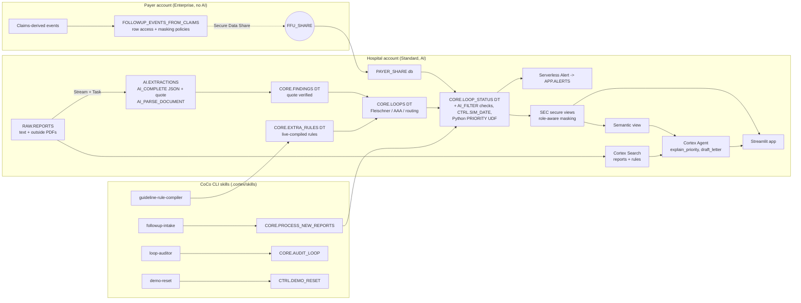

# Forgotten Follow-ups

**When a scan report says "repeat this scan in 6 months" or "refer to a surgeon", this copilot makes sure it actually happens, and proves every step with the exact source line.**

Built on Snowflake for the Snowflake CoCo CLI Hackathon 2026 (GCC Edition), Track 4: Patient and Member 360 and Clinical or Regulatory Document Copilot. All data is synthetic, except Set A (real, de-identified, never committed). This is not a diagnostic tool, and it never overrides a radiologist.

- **Prototype:** https://app.snowflake.com/JVHFISR/pb73401/#/streamlit-apps/FFU.APP.FFU_APP
- **Demo video:** `[GIF / video placeholder]`
- **Demo script:** [docs/DEMO_SCRIPT.md](docs/DEMO_SCRIPT.md). **Rule sheet:** [docs/RULE_SHEET.md](docs/RULE_SHEET.md). **Plan:** [docs/PLAN_SPEC.md](docs/PLAN_SPEC.md). **Build log:** [docs/BUILD_LOG.md](docs/BUILD_LOG.md).

## The problem

- **A reported lawsuit (an allegation, not a ruling).** It alleges that an 8 mm lung nodule with a recommended follow-up CT in 6 to 12 months was never communicated, and that the patient was diagnosed with stage 4A lung cancer about three years later. ([Fox Carolina, Sept 2026](https://www.foxcarolina.com/2026/09/16/woman-was-not-told-about-lung-nodule-years-before-terminal-cancer-diagnosis-lawsuit-alleges/))
- **How often follow-ups are missed.** Only 37% of recommended lung nodule follow-ups were completed before a tracking programme, and 74% after. ([Nodule Net, Respiratory Medicine 2022](https://www.sciencedirect.com/science/article/pii/S0954611122000026))
- **The gap.** Hospital trackers only see their own records. When the follow-up happens at another hospital, they can't tell whether it was done. Payer claims can show this, so this project brings them in through **Secure Data Sharing**, with no data copied.

## What it does

1. Reads every scan report with AI and pulls out each "do this, by this date", with a **verbatim evidence quote** that is checked word for word against the source.
2. Applies **deterministic SQL rules**: Fleischner 2017 lung nodules, chest X-ray "recommend CT", SVS 2018 AAA, and pathway routing. AI never decides a status.
3. Checks hospital records **and the payer's shared claims**, and marks each loop:
   - **RED**: overdue;
   - **AMBER**: done elsewhere, outside report requested;
   - **GREEN**: a follow-up report exists and AI_FILTER confirms it discusses the finding;
   - **REROUTED**: moved to another pathway, with the reason shown.
4. **The wrong test never closes a loop.** A chest X-ray claim cannot close a CT loop.
5. Ranks the worklist with a transparent priority UDF, explains "why first" with citations, and drafts recall letters that a clinician must approve.

## Architecture



**One code path:** the CoCo skills, the Task and the app's buttons all call the same stored procedures.

## Results

Source: `eval/metrics.json`. The official Set C run comes from the `CTRL.DEMO_RESET(TRUE)` state.

| Set | What | System | Keyword baseline | AI-only baseline |
| --- | --- | --- | --- | --- |
| C | 700 synthetic index reports, hidden answer key written before the text | **99.1%** loop status (95% CI 98.1-99.6), **0 false greens** (upper bound 2.6%) | 61.4%, 94 false greens | 60.4% (96-report sample), 13 false greens |
| B | 36 trap reports (38 findings), labels written first, held out | **36/36**, 0 false greens; size, tier, action and pathway 30/30 | 18/36, 5 false greens | 21/36, 5 false greens |
| A | 120 real Indiana University chest X-ray reports | extracted; **scoring pending hand labels** | - | - |

- **Quotes verified:** 99.9%. One Set C quote didn't match its source exactly and is flagged in the app.
- **Cost:** at most about 1.3 AI credits per 1,000 reports. This upper bound covers the whole build day, including generation and tests. **Latency:** about 21 ms per report in a batch, and 3.5 s for a single report.
- **Simulated impact on the synthetic hospital (SIMULATED):**
  - completion is 35.9% with hospital-only visibility, which matches the published 37% baseline;
  - 50.9% with the payer share;
  - **78.8%** with worklist recall. This assumes recall recovers 59% of missed loops, derived from Nodule Net.
  - Median days to close: 74.

**Three honest failure cases:**
1. Two reports failed the extraction JSON schema, so no loop opened. They now appear in a review queue.
2. "Mass-like opacity" on X-ray versus "nodule" on CT: AI_FILTER didn't confirm the follow-up, so the loop stayed RED as "needs review". That's safe, but it creates extra work.
3. Priority saturates for long-overdue tier-1 loops; days overdue breaks the tie.

## CoCo CLI skills (product workflow)

| Skill | Input | Processing | Output |
| --- | --- | --- | --- |
| `followup-intake` | report `.txt` or `.pdf` files | `INGEST_REPORT` or `INGEST_OUTSIDE_PDF` (AI_PARSE_DOCUMENT), then `PROCESS_NEW_REPORTS()` | new loops with priority breakdown, communication status and verified quote |
| `loop-auditor` | patient or loop ID, optional new demo date | `AUDIT_LOOP` recomputes from raw rows plus the payer share; `ADVANCE_CLOCK` fires the alert | MATCH/MISMATCH, with citations |
| `guideline-rule-compiler` | a guideline paragraph | writes `sql/rules/<rule>.sql` into the `EXTRA_RULES` Dynamic Table, **stops for approval**, then runs the pre-written tests and re-runs the eval | rule file, PASS/FAIL per test, eval before vs after |
| `demo-reset` | optional "including extensions" | `DEMO_RESET(bool)` plus payer cleanup | PASS/FAIL checklist |

**Hooks** (`.cortex/settings.json`):
- **PreToolUse** blocks SSN- and Aadhaar-like numbers, dropping secure views or policies, and destructive DDL on curated tables (`tests/hook_tests.ps1`, 12/12).
- **SessionEnd** appends to `docs/coco-log.md`.

**Bundled skills used:** agent-studio, developing-with-streamlit-in-snowflake, snowflake-notebooks, cortex-code-guide and marketplace-search.

## Snowflake features used

Snowpark Python UDF, AI_COMPLETE (structured JSON), AI_FILTER, AI_PARSE_DOCUMENT, Dynamic Tables, Streams and Tasks, serverless Alerts, Cortex Search, semantic view, Cortex Agent (DATA_AGENT_RUN), Secure Data Sharing across accounts, row access and masking policies (payer side), role-aware secure views (hospital side), Streamlit in Snowflake (container runtime, restricted caller's rights), a Workspace Notebook (`eval/eval_harness.ipynb`), resource monitor, METERING_HISTORY, and the Snowflake CLI.

## Setup (runbook)

You need two accounts in the same region: hospital (connection `hospital`) and payer (connection `payer`). Use Snowflake CLI 3.14 or later, PowerShell, and Python 3.12.

```powershell
snow sql -c hospital -f sql/01_setup.sql
snow sql -c hospital -f sql/02_patients_answer_key.sql
snow sql -c hospital -f sql/03_generate_reports.sql      # AI generation (about 850 calls)
snow sql -c hospital -f sql/04_hospital_events.sql
snow sql -c payer    -f sql/payer/01_payer.sql            # edit the consumer locator in ALTER SHARE first
snow sql -c payer    -f sql/payer/02_payer_events.sql
snow sql -c hospital -f sql/05_mount_share.sql            # edit the provider org.account first
snow sql -c hospital -f sql/06_extraction.sql
snow sql -c hospital -f sql/07_rules.sql
snow sql -c hospital -f sql/08_automation.sql
snow sql -c hospital -f sql/09_skill_procs.sql
snow sql -c hospital -f sql/10_demo_seed.sql
snow sql -c hospital -f sql/11_access_control.sql
snow sql -c hospital -f sql/12_copilot.sql
snow sql -c hospital -f agent/create_agent.sql
snow sql -c hospital -f sql/14_outside_pdf.sql
cd app; snow streamlit deploy ffu_app -c hospital --replace; cd ..
snow sql -c hospital -f sql/13_app_access.sql
snow sql -c hospital -f tests/thyroid/01_seed.sql
snow sql -c hospital -q "CALL FFU.CORE.RUN_PIPELINE()"
snow sql -c hospital -f eval/01_run_eval.sql
snow sql -c hospital -q "CALL FFU.CTRL.DEMO_RESET(TRUE)"
```

**Tests:**
- `powershell -File tests/hook_tests.ps1`
- `powershell -File tests/check_answer_key_isolation.ps1`
- `snow sql -c hospital -f tests/priority_scale.sql`
- `.venv\Scripts\python.exe tests\app_smoke_test.py` (19 headless AppTest checks)

**Eval:** run `eval/setB/*.sql`, `eval/02_baselines.sql` and `eval/03_simulated_impact.sql`, then `eval/export_metrics.ps1`.

## Known limits

- **Set B** labels were written by the builder from the rule sheet; there was no outside tester.
- **Set A** metrics are pending hand labels. Open-i has no demographics, so routing checks on Set A use default patient values.
- **Synthetic data.** The cohort is generated in Snowflake from a hidden key, not with Synthea. The 37% baseline is built into the data design.
- **The app runs with owner's rights**, so it always shows full detail. The analyst view is shown with `sql/demo/analyst_view.sql`, or with the caller's-rights toggle for a user whose *default* role is FFU_ANALYST.
- **The thyroid rule is not shipped.** It is added live by `guideline-rule-compiler`; its tests are in `tests/thyroid/`.
- **The cost figure is an upper bound** from one build day (`METERING_HISTORY` is hourly).
- **No fresh-account rebuild test** has been run yet.

## Roadmap

Synthea population, Marketplace synthetic clinical and claims listing (checked: free and available in-region, not mounted), Native App packaging, the agent in Snowflake Intelligence, Git integration, a Hindi patient letter, a fresh-account rebuild test, an outside tester for Set B, and ABDM (India's consent-based health record exchange) as the bridge for Indian hospitals.

## Data and licences

See [docs/DATASETS.md](docs/DATASETS.md). Set A text (CC BY-NC-ND 4.0) is never committed.

## Licence

See [LICENSE](LICENSE). "Built on Snowflake"; the product name and branding do not use Snowflake's name or logo.
